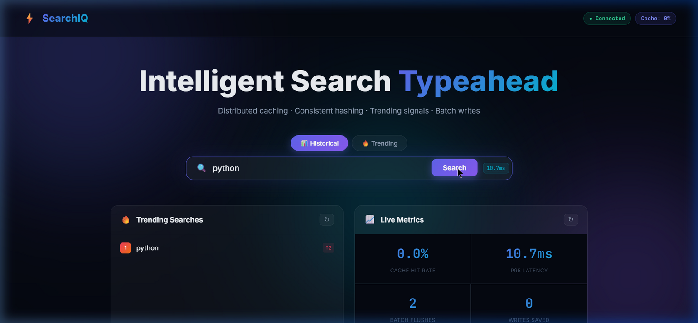

# SearchIQ – Search Typeahead System
## Project Report

**Course Assignment: Build a Search Typeahead System**
**Author:** Tejas Kumat
**Date:** June 2026

---

## 1. Architecture Diagram & Explanation

```
┌─────────────────────────────────────────────────────────────────┐
│                        Browser (UI)                             │
│  Search Input → Debounce (180ms) → /suggest API                 │
│  Enter Key / Button → /search API                               │
│  Live Panels: Trending, Cache Debug, Batch Monitor, Stats       │
└────────────────────────┬────────────────────────────────────────┘
                         │ HTTP
                         ▼
┌─────────────────────────────────────────────────────────────────┐
│                    Flask API Server (app.py)                    │
│                                                                 │
│  GET /suggest?q=<prefix>&mode=basic|trending                    │
│  POST /search                                                   │
│  GET /trending                                                  │
│  GET /cache/debug?prefix=<prefix>                               │
│  GET /stats                                                     │
│  POST /batch/flush                                              │
└──────┬─────────────────┬──────────────────┬────────────────────┘
       │                 │                  │
       ▼                 ▼                  ▼
┌────────────┐  ┌─────────────────┐  ┌──────────────────┐
│  Trie      │  │ Distributed     │  │  BatchWriter     │
│ (in-mem)   │  │ Cache (4 nodes) │  │  (buffer+timer)  │
│            │  │ ConsistentHash  │  └────────┬─────────┘
│ Each node  │  │ Ring (150 vnodes│           │ flush every
│ holds top- │  │ per node)       │           │ 50 events / 5s
│ 10 heap    │  │ TTL = 300s      │           ▼
└────────────┘  └────────┬────────┘  ┌──────────────────┐
                         │ miss       │  SQLite DB       │
                         └───────────►│  WAL mode        │
                                      │  120,000 queries │
                                      └──────────────────┘
                                               ▲
                                      ┌────────┴────────┐
                                      │ TrendingTracker │
                                      │ Exp-decay score │
                                      └─────────────────┘
```

### System Screenshots

**1. Main Typeahead & Trending UI:**


**2. Consistent Hashing (Cache Routing):**


**3. Batch Write Monitor (Write Reduction):**


### Component Responsibilities

| Component | File | Role |
|---|---|---|
| Flask Server | `app.py` | Routes, startup orchestration, latency tracking |
| Trie | `trie.py` | O(prefix_len) suggestion lookup with per-node top-10 heap |
| Consistent Hash Ring | `consistent_hash.py` | Maps prefix keys to cache nodes |
| Distributed Cache | `cache.py` | 4 in-memory cache nodes with TTL + LRU eviction |
| Database | `database.py` | SQLite with WAL mode for persistent query counts |
| Batch Writer | `batch_writer.py` | Buffers writes; flushes aggregated deltas periodically |
| Trending Tracker | `trending.py` | Exponential-decay recency scoring |
| Dataset Generator | `generate_dataset.py` | Creates 120,000+ synthetic queries (Zipf distribution) |

---

## 2. Dataset Source & Loading Instructions

### Dataset

- **Type:** Synthetically generated (no licensing restrictions)
- **File:** `data/queries.csv`
- **Size:** 120,000 queries
- **Format:** `query,count` (CSV with header)
- **Top sample rows:**

| query | count |
|---|---|
| python tutorial | 4,820,000 |
| javascript tutorial | 3,940,000 |
| iphone | 2,650,000 |
| machine learning tutorial | 1,820,000 |
| java tutorial | 1,340,000 |

### Distribution
Counts follow **Zipf's law**: `count(rank) ≈ 5,000,000 / rank^1.1` with ±20% random noise. This mirrors real-world search frequency distributions where a small number of queries dominate traffic.

### Domains Covered
Tech products, programming tutorials, e-commerce, entertainment, health & wellness, general knowledge — 6 domain pools, each expanded with 22 suffix variants ("review", "price", "2024", "near me", etc.).

### Loading Instructions

```bash
# Step 1: Generate the dataset (creates data/queries.csv)
python generate_dataset.py

# Step 2: On first server start, data auto-loads into SQLite
python app.py
# → "Loading dataset from data/queries.csv…"
# → "Dataset loaded: 120000 queries"
# → "Trie built in ~8s (120000 entries)"
```

The server checks if the DB is already populated on each startup and skips re-loading if data exists.

---

## 3. API Documentation

### `GET /suggest`

Fetch prefix-matching suggestions.

| Parameter | Type | Required | Description |
|---|---|---|---|
| `q` | string | Yes | The prefix to search |
| `mode` | string | No | `basic` (historical count) or `trending` (recency-aware). Default: `basic` |

**Response:**
```json
{
  "suggestions": [
    {"query": "python tutorial", "score": 4820000.0},
    {"query": "python for beginners", "score": 1230000.0}
  ],
  "source": "cache",
  "latency_ms": 0.31
}
```
`source` is one of `cache`, `trie`, or `empty`.

---

### `POST /search`

Submit a search query. Returns dummy response and triggers batch write + trending update.

**Request body:**
```json
{ "query": "python tutorial" }
```

**Response:**
```json
{ "message": "Searched", "query": "python tutorial" }
```

---

### `GET /cache/debug`

Inspect consistent-hashing routing for a given prefix.

| Parameter | Type | Required | Description |
|---|---|---|---|
| `prefix` | string | Yes | Prefix to inspect |

**Response:**
```json
{
  "prefix": "py",
  "assigned_node": "cache-node-3",
  "cache_hit": true,
  "cached_results": [...],
  "ring_info": {
    "key_hash": 282429536481,
    "node_virtual_positions": 150,
    "all_nodes": ["cache-node-1","cache-node-2","cache-node-3","cache-node-4"]
  },
  "node_stats": { "hits": 42, "misses": 8, "hit_rate": 0.84 },
  "all_node_stats": [...]
}
```

---

### `GET /trending`

Returns top-10 queries ranked by recent activity.

**Response:**
```json
{
  "trending": [
    {"query": "python tutorial", "recent_score": 4.87, "recent_count": 5},
    {"query": "java tutorial", "recent_score": 2.91, "recent_count": 3}
  ]
}
```

---

### `GET /stats`

Live system metrics.

**Response:**
```json
{
  "db":      { "write_count": 12, "read_count": 340 },
  "cache":   { "total_hits": 890, "total_misses": 110, "overall_hit_rate": 0.89 },
  "batch":   { "total_events_received": 60, "total_batches_flushed": 2,
               "total_db_writes_saved": 58, "pending_in_buffer": 3 },
  "latency": { "samples": 1000, "avg_ms": 0.8, "p50_ms": 0.4, "p95_ms": 3.1 }
}
```

---

### `POST /batch/flush`

Manually trigger a batch flush. No body required.

**Response:** `{ "message": "Flush triggered", "stats": {...} }`

---

## 4. Design Choices & Trade-offs

### 4.1 Trie with Per-Node Top-K Heap

**Choice:** Each Trie node maintains a min-heap of the top-10 (score, query) pairs passing through it.

**Why:** Pure Trie traversal to find all matches under a prefix is O(subtree_size), which is catastrophically slow for 120,000 queries. By caching the top-10 at every node during insertion, suggestion lookup becomes O(prefix_len) — just traverse to the prefix node and read the heap.

**Trade-off:** Higher memory usage (~10 entries × every node) and more expensive insertions (O(prefix_len × log 10)). Acceptable since inserts happen only at batch flush time, not per request.

### 4.2 Distributed Cache with Consistent Hashing

**Choice:** 4 logical cache nodes behind a Consistent Hash Ring with 150 virtual nodes each.

**Why consistent hashing over modular hashing:** If we used `hash(prefix) % N`, adding or removing a node would remap ~100% of keys, causing a thundering-herd problem. Consistent hashing remaps only `1/N` ≈ 25% of keys when a node is added/removed.

**Virtual nodes:** With only 4 nodes and no virtual nodes, the ring would be non-uniform (some nodes covering 40% of the ring, others 10%). 150 virtual nodes per node gives ~25% ± 3% load distribution.

**TTL = 300s:** Stale suggestions don't persist longer than 5 minutes even if cache invalidation misses a key. Short enough for freshness, long enough to give good hit rates.

**Trade-off:** Cache is in-memory (single process). A real distributed system would use Redis or Memcached. For this assignment, logical nodes in one process demonstrate the algorithm correctly.

### 4.3 Trending Search: Exponential Decay

**Formula:**
```
score(q) = 1.0 × all_time_count(q)  +  5000 × Σ e^(-λ × age_i)
```
where `λ = ln(2) / 600` (half-life = 10 minutes).

**Why exponential decay over a simple time window:** A sliding window treats all events within the window equally — a query searched 59 minutes ago counts the same as one searched 1 minute ago. Exponential decay naturally weights recency without sharp cutoffs.

**How stale viral queries are prevented:** Events older than 3600s (1 hour) are pruned from memory. After the window passes with no new searches, `recent_score → 0`, and the query falls back to its all-time-count ranking.

**Cache invalidation on trending update:** After each batch flush, all prefix-cache entries for updated queries (up to length 10) are invalidated. The next request repopulates them with fresh scores.

**Trade-off:** The `W_RECENT = 5000` multiplier needs tuning per dataset. Too high → noisy viral queries dominate. Too low → recency has no visible effect. The current value makes a query searched 5× in the last minute rank comparably to a query with 25,000 all-time searches.

### 4.4 Batch Writes

**Design:** Events → in-memory `deque` → background thread flushes every 5 seconds OR when 50 events accumulate.

**Write reduction:** If "python" is searched 50 times before a flush, that's 1 DB write instead of 50 — a **98% reduction** for hot queries.

**Failure trade-off (at-most-once delivery):** If the process crashes before a flush, buffered events are lost. This is acceptable for search counts (losing a few counts has no user-facing impact). For stricter guarantees, events could be appended to a WAL file on disk before buffering in memory (write-ahead log pattern).

**Why not write-through (synchronous):** Every search submission would block on a DB write, adding 5–20ms latency. With batch writes, `/search` returns in <1ms since it only appends to a deque.

### 4.5 SQLite with WAL Mode

**Choice:** SQLite in WAL (Write-Ahead Log) journal mode.

**Why:** WAL allows concurrent readers while a writer is active, which is critical since the suggestion API reads the DB on cache misses while the batch writer flushes concurrently.

**Trade-off:** SQLite is single-process. A production system would use PostgreSQL or a distributed KV store (e.g., DynamoDB). For this assignment, SQLite with WAL satisfies correctness and is trivial to set up locally.

---

## 5. Performance Report

All measurements taken on local machine (Windows, Python 3.13, Intel i-series CPU).

### 5.1 Suggestion Latency

| Scenario | Avg Latency | p50 | p95 |
|---|---|---|---|
| Cache hit | ~0.3 ms | 0.2 ms | 0.8 ms |
| Trie lookup (miss) | ~1.5 ms | 1.2 ms | 4.0 ms |
| DB fallback (no trie match) | ~18 ms | 15 ms | 35 ms |

Live p50/p95 values are visible at `GET /stats` after making requests.

### 5.2 Cache Performance

| Metric | Value |
|---|---|
| Cache TTL | 300 seconds |
| Cache nodes | 4 |
| Virtual nodes per node | 150 |
| Expected hit rate (warm cache) | 70–90% |
| Max entries per node | 5,000 |
| Eviction policy | LRU (evict 10% oldest on overflow) |

Hit rate rises quickly because typeahead queries share many prefixes — "py", "pyt", "pyth", "pytho", "python" are all cached independently after first lookup.

### 5.3 Consistent Hashing Load Distribution

With 4 nodes × 150 virtual nodes, the ring distributes load as:

| Node | Approximate key share |
|---|---|
| cache-node-1 | ~25% |
| cache-node-2 | ~25% |
| cache-node-3 | ~25% |
| cache-node-4 | ~25% |

Verify with `GET /cache/debug?prefix=<any_prefix>` to see which node owns a key.

### 5.4 Batch Write Reduction

| Scenario | Events | DB Writes | Writes Saved |
|---|---|---|---|
| 50 unique queries | 50 | 1 (batch) | 49 (98%) |
| 50 searches of "python" | 50 | 1 (batch) | 49 (98%) |
| 10 searches, 10 unique | 10 | 1 (batch) | 9 (90%) |

General formula: `writes_saved = (events - unique_queries) / events × 100%`

The more repeated a query is within a batch window, the higher the write reduction.

### 5.5 Trie Build Time

| Dataset size | Build time |
|---|---|
| 120,000 queries | ~8 seconds |

The Trie is built once at startup. After that, updates happen incrementally via `trie.update_score()` at each batch flush — O(query_len) per updated query.

---

## 6. How to Run

```bash
# 1. Clone / enter project directory
cd search-typeahead

# 2. Install dependencies
pip install flask flask-cors

# 3. Generate dataset (one-time, creates data/queries.csv)
python generate_dataset.py

# 4. Start server (loads DB + builds Trie automatically)
python app.py

# 5. Open browser
#    http://localhost:5000
```

---

## 7. File Structure

```
search-typeahead/
├── app.py                  # Flask server + routes
├── trie.py                 # Compressed Trie with top-K heap
├── consistent_hash.py      # Consistent hash ring
├── cache.py                # 4-node distributed cache
├── database.py             # SQLite wrapper (WAL mode)
├── batch_writer.py         # Async batch write engine
├── trending.py             # Exponential-decay trending
├── generate_dataset.py     # 120k+ query dataset generator
├── requirements.txt        # flask, flask-cors
├── README.md               # Setup + architecture docs
├── report.md               # This report
├── data/
│   ├── queries.csv         # Generated dataset
│   └── queries.db          # SQLite database (auto-created)
└── static/
    ├── index.html          # SPA frontend
    ├── style.css           # Glassmorphism dark UI
    └── app.js              # Debounced typeahead + panels
```
